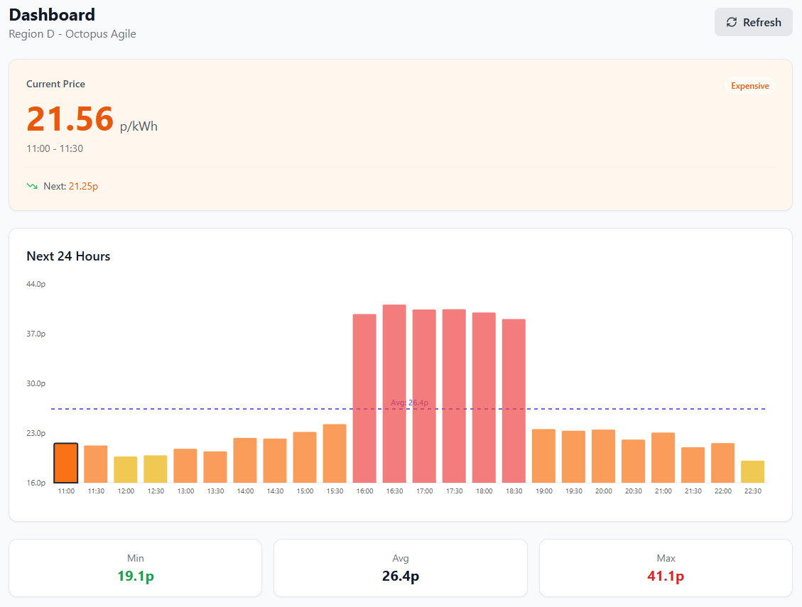
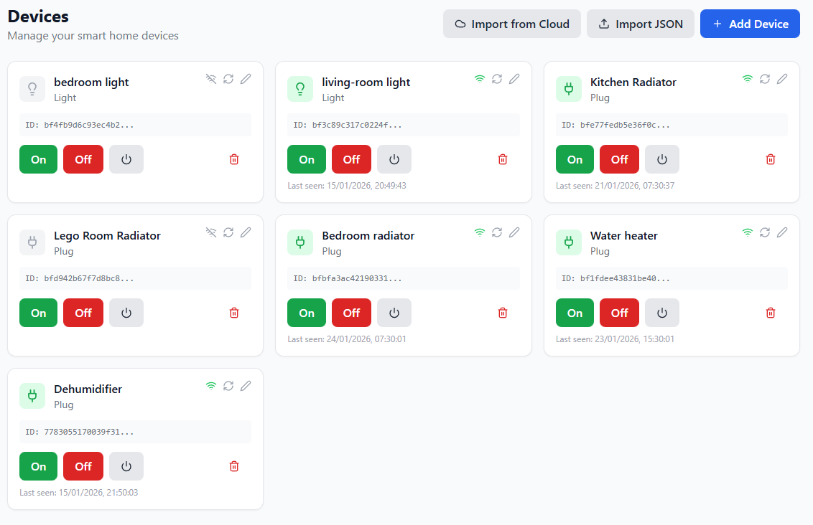
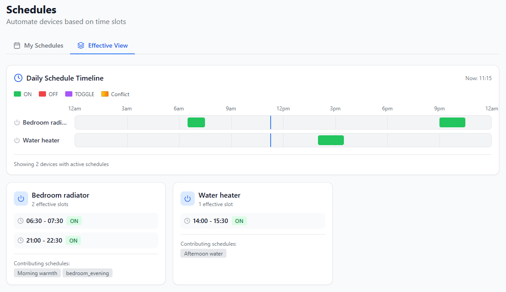

<p align="center">
  
</p>

<h1 align="center">Energy Controller</h1>

<p align="center">
  <strong>Smart home device management designed for the Octopus Energy Agile tariff</strong>
</p>

<p align="center">
  Automatically schedule your smart devices to run during the cheapest electricity periods. Or manually set up device schedules to suit your needs.<br>
</p>


## Why?

Electricity prices on **Octopus Agile** change every 30 minutes based on wholesale market rates. Prices can vary from negative up to £1 per KWh. Energy Controller helps you:

- **Visualize** real-time and upcoming prices with intuitive color-coded charts
- **Automate** your smart devices to run during the cheapest periods
- **Save money** by shifting energy usage away from expensive peak hours
- **Reduce carbon** by using electricity when the grid is cleanest (often the cheapest times)

Additionally the scheduling windows allow for multiple devices to be assigned, simplifying the exisiting setup using just the Tuya smart home app.


## Features

### Real-time Price Tracking
Live electricity prices updated every 30 minutes directly from Octopus Energy. See current rates, upcoming prices, and historical data at a glance.

### Smart Price Visualization
Color-coded charts make it easy to spot cheap (green) and expensive (red) periods. Plan your energy usage with confidence.

### Device Control
Connect and control your Tuya-compatible smart devices. Turn plugs, switches, and appliances on/off remotely.

### Automated Scheduling
Create smart schedules that automatically trigger devices based on price thresholds. "Turn on the EV charger when prices drop below 10p/kWh."

### Multi-Region Support
Full coverage across all 14 UK electricity regions. Select your region in settings for accurate local pricing.

### Mobile-First Design
Responsive interface works beautifully on phone, tablet, and desktop. Dark mode included.


## Screenshots

### Dashboard
The main dashboard shows current price, next price, and a 24-hour price chart with statistics.



### Devices
Manage and control your smart devices. View status, toggle power, and configure settings.



### Schedules
Create automated schedules based on price thresholds or specific time slots.



---

## Getting Started

### Prerequisites

- Node.js 20+
- pnpm 8+ (`npm install -g pnpm`)
- Windows users: Use WSL or [Visual Studio Build Tools](https://visualstudio.microsoft.com/visual-cpp-build-tools/) for SQLite

### Installation

```bash
# Install dependencies
pnpm install

# Build shared package
pnpm --filter @octopus-controller/shared build

# Start the app
pnpm dev
```

Open http://localhost:5173, go to **Settings**, select your electricity region and add your API keys, and you're ready to go.

---

## Tech Stack

| Layer | Technologies |
|-------|--------------|
| Frontend | React, Vite, TypeScript, Tailwind CSS, Recharts |
| Backend | Node.js, Express, TypeScript, Drizzle ORM |
| Database | SQLite |
| Infrastructure | Docker, Terraform (AWS) |

---